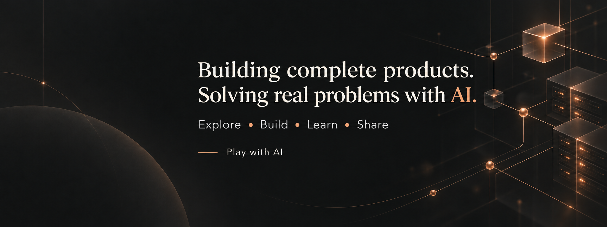

# Hi, I’m Esmattoha (Dipu)

**Product Developer | Building Complete Products with AI**

I turn ideas into useful products and use AI to solve real-world problems. My work spans frontend experiences, backend functionality, database management, and bringing everything together into a working solution.

I love exploring new AI tools, testing ideas, and finding practical ways to simplify workflows and solve problems. Through **[Play with AI](https://www.youtube.com/@dipu-play-with-ai)**, I share hands-on experiments, useful tools, and lessons from building with AI.

Follow along for practical AI exploration, product-building experiments, and real-world problem solving.

[Explore my work](https://www.esmattoha.com/) · [Play with AI](https://www.youtube.com/@dipu-play-with-ai) · [LinkedIn](https://www.linkedin.com/in/esmattoha/) · [X](https://x.com/EsmattohaM)
